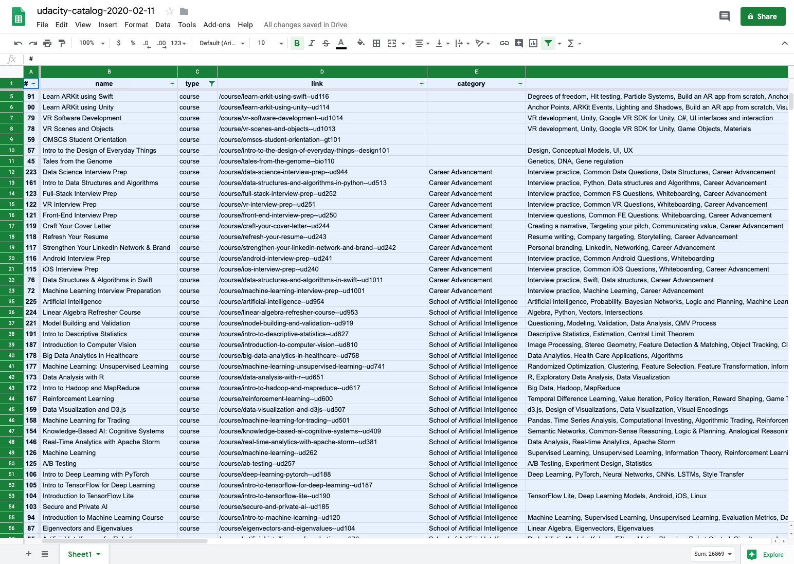

# Udacity Catalog

This tool downloads the full [Udacity catalog](https://www.udacity.com/courses/all) and saves it as a dated CSV file.

I built it as I wanted one central place to see all of Udacity's courses. This project gave me the opportunity to learn how to use Selenium to navigate web sites.

## Technologies Used

- [Selenium]: To interact with the pop ups that showed up on the Udacity Catalog page at the time the project was developed.
- [BeautifulSoup]: To scrape website content
- [Pandas]: To deal with formatting the data and outputing it as a CSV file
- [FastAPI]: Web Framework for Server
- [TinyDB]: JSON File Storage

Given the small volume of data, the usage of Pandas is probably overkill - I just really enjoy using it. Given the project's small scope, I'd be interested in exploring more lightweight approaches (using core Python vs 3rd party libraries).

---

## Extension Ideas

- Create an RESTful API to query the courses (all, by category, by type)
- Built a simple table interface to filter and query the collected data. Something that looks like the below Google sheet example:

[//]: # (References)

[Selenium]: https://selenium.dev/
[BeautifulSoup]: https://www.crummy.com/software/BeautifulSoup/
[Pandas]: https://pandas.pydata.org/
[FastAPI]: https://fastapi.tiangolo.com/
[TinyDB]: https://tinydb.readthedocs.io
